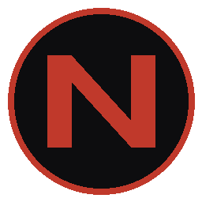
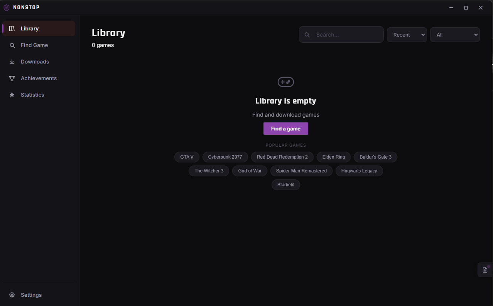
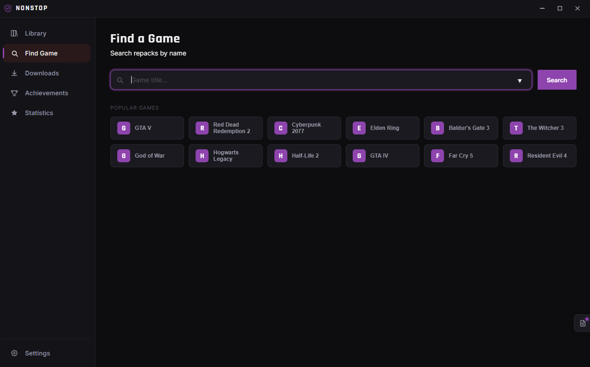
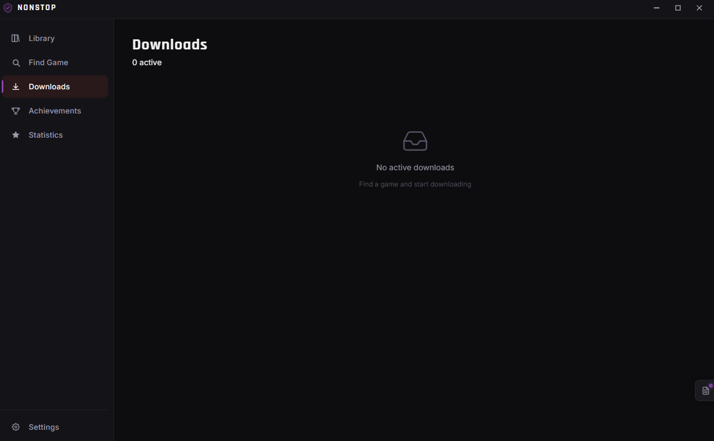
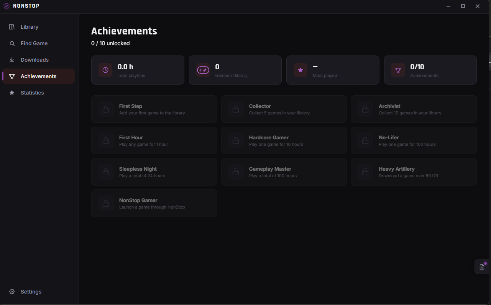
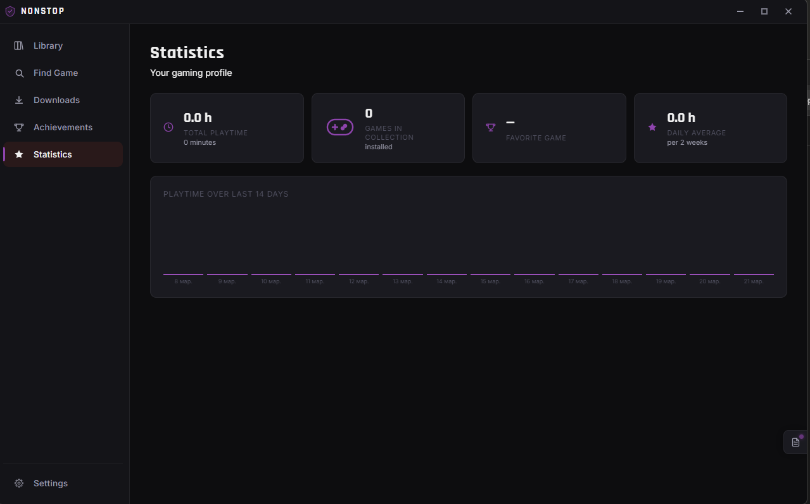
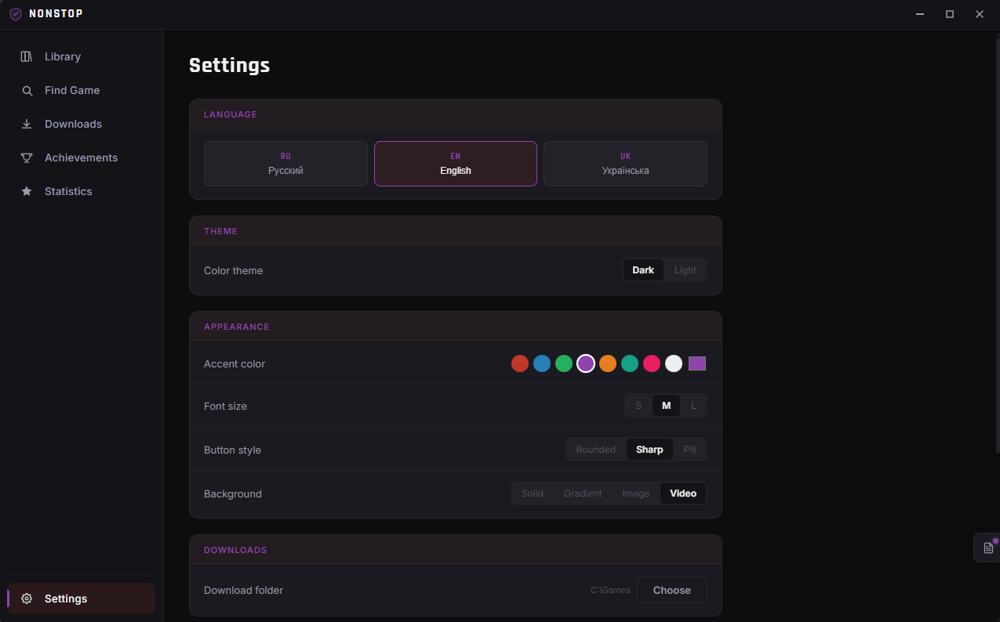

<div align="center">



# NonStop Launcher

A free, open-source game launcher with a built-in torrent downloader.  
Find repacks, download, and launch — all in one place.

[](https://github.com/Ma7eyka/NonStopLauncher/releases/latest)
[](https://github.com/Ma7eyka/NonStopLauncher/releases)
[](https://github.com/Ma7eyka/NonStopLauncher/releases)
[](LICENSE)

**[Download latest release](https://github.com/Ma7eyka/NonStopLauncher/releases/latest)** — Windows x64

</div>

---

## Screenshots

<div align="center">










</div>

---

## Overview

NonStop Launcher is a desktop application built with Electron and React. It lets you search for game repacks from sources like FitGirl Repacks, download them via a built-in BitTorrent client, and manage your game library — without ever leaving the app.

Inspired by [Hydra Launcher](https://github.com/hydralauncher/hydra). Built from scratch.

---

## Features

**Library**  
Steam covers fetched automatically. Sort by recently added, name, or playtime. Filter by installed or downloading. Click any game to open its full info page with Steam screenshots and description.

**Downloads**  
WebTorrent-powered with real-time speed graphs, pause/resume, and auto-resume after restart. Downloads continue in the system tray when the window is closed.

**Playtime tracking**  
Tracks time spent in each game using process polling — counts only while the game process is actually running.

**Achievements**  
10 unlockable achievements tied to your library size and playtime.

**Statistics**  
14-day playtime chart, top games leaderboard, daily average.

**Customization**  
Accent color, dark/light theme, custom background (image, GIF, or video).

**Multi-language**  
Russian, English, Ukrainian — switch instantly in Settings.

**Backup**  
Export and import your library as a JSON file.

---

## Installation

Download the latest installer from [Releases](https://github.com/Ma7eyka/NonStopLauncher/releases/latest) and run it.

**Build from source:**

```bash
git clone https://github.com/Ma7eyka/NonStopLauncher
cd NonStopLauncher
npm install
npm run electron:dev
```

**Build installer:**

```bash
npm run electron:build
```

Output: `release/NonStop Launcher Setup x.x.x.exe`

---

## Stack

| | |
|---|---|
| UI | React 18 + Vite 5 |
| Desktop | Electron 29 |
| Database | sql.js (SQLite — no native build required) |
| Torrents | WebTorrent 2 |
| Covers | Steam Store API |

---

## Releasing a new version

1. Bump `version` in `package.json`
2. Add entry to `src/renderer/components/Changelog.jsx`
3. Create a [classic GitHub token](https://github.com/settings/tokens) with `repo` scope — must start with `ghp_`
4. Run:

```powershell
$env:GH_TOKEN = "ghp_your_token"
npm run electron:build -- --publish always
```

---

## Changelog

### v1.0.7
- Playtime counter now verifies the game process is actually running via `tasklist`
- Hours stop counting when the game is closed
- Full translation of all pages — Russian, English, Ukrainian
- Closing the window always minimizes to tray

### v1.0.6
- Playtime counter works for games that spawn a child process and exit
- "Never played" status updates immediately on first launch
- Tray icon click always restores the window
- Closing the window minimizes to tray instead of quitting

### v1.0.5
- Fixed grey screen on startup
- Fixed OTA update check using GitHub API directly
- Faster startup

### v1.0.4
- Fixed sidebar labels not displaying
- "Never played" status fixed
- "Playing" badge on game card while game is open
- Playtime shows hours and minutes

### v1.0.3
- Russian, English, Ukrainian language support
- Changelog moved to right-side panel with a dedicated icon
- Settings reorganized into labeled sections

### v1.0.2
- Fixed setup.exe launch requiring admin rights
- Fixed duplicate downloads and phantom database records
- Auto-resume downloads after launcher restart
- Game modal with Info / Settings / Files tabs
- Launch arguments per game
- System tray support
- Game page with Steam screenshots
- Statistics page with 14-day playtime chart
- Sort and filter in library
- Dark / light theme
- Export / import library backup

### v1.0.1
- Fixed `lastId()` returning 0 in database
- Fixed HTML entities in magnet links
- Real-time download speed chart
- Steam Store API covers

### v1.0.0
- Initial release
- FitGirl Repacks and SteamRIP search
- WebTorrent downloader
- Game library with Steam covers
- Frameless Electron window

---

## Contributing

Issues and pull requests are welcome.  
If something is broken, open an [issue](https://github.com/Ma7eyka/NonStopLauncher/issues).  
If you want to add something, open a [discussion](https://github.com/Ma7eyka/NonStopLauncher/discussions) first.

---

## Disclaimer

This project is for educational purposes. The developers are not responsible for how it is used. Respect copyright law in your country.

---

## License

[MIT](LICENSE) — Ma7eyka, 2026
